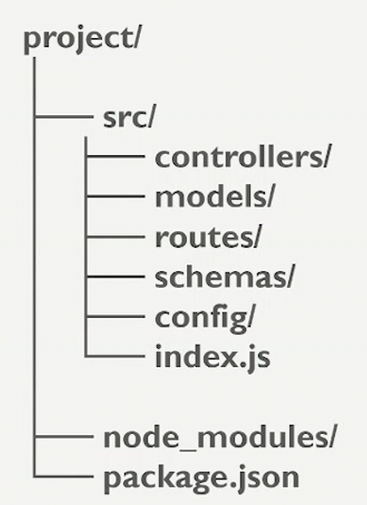

### Promesas
* En el codigo sincronico el flujo de ejeucion se detiene hasta que se completa la tarea.
* En el codigo asincronico permite que el flujo de ejecucion continue mientras se espera a que se complete una determinada tarea.

Las **promesas** son objetos que representan la eventual finalizacion o fracaso de una operacion asincronica y su valor resultante

* .then() se utiliza para manejar el resultado exitoso de una promesa, mientras que .catch() se utiliza para manejar cualquier error que pueda ocurrir durante la ejecucion de la promesa

* **async/await** es una sintaxis que permite escribir codigo asincronico de manera mas legible y facil de entender
* async se utiliza para declarar una funcion asincronica, mientras que await se utiliza para esperar a que una promesa se resuelva antes de continuar con la ejecucion del codigo
* async y await van de la mano, es para que sea una funcion asincronica


**Cada operacion de base de datos DEBE ser asincronica**

### ORM
Mapea el codigo de js para poder hacer consultas en la base de datos
* clase a tablas
* objetos a filas
* atributos a columnas
* relaciones entre objetos a relaciones entre tablas


### Manejo de errores
* El try catch captura el error y hace algo, para que si se rompe la app no se caiga, sino que mande un mensaje de error

    
--------------------------------------------------------------------------
## Estructura básica de las carpetas

* Models: un archivo por cada tabla
* Index.js: Definir las relaciones, exportar los modelos
### Crear proyecto de cero

**Inicializar proyecto de Node**
```
npm init -i
```
si da error usar antes:
```
nvm install 20
```
esto crea el package.json

**Instalar los packetes: express, equelize y sqlite**
```
npm i express sequelize sqlite3
```

**Instalar Nodemon**
* Reinicia la aplicacion cuando hay cambios, es un packete de desarrollo
```
npm i -D sequelize-cli
```


Despues de esto en el package.json se crea un nuevo atributo de dependencias(dependencies) con los packetes instalados que tengo que instalar si o si cuando pase a produccion para que la app funcione, las devDependencies(como nodemon) no son necesarias en produccion

**Instalar Sequelize-cli**
* Inicializa el proyecyo con la estructura tipica de sequelize
* Crea Seeders, llena la tabla de base de datos con ejemplos para hacer pruebas 
* Crea migraciones, hace un historial de los cambios que hago en las tablas
* Crea modelos, cada modelo es una tabla en la base de datos
```
npm i -D nodemon
```

------------------------------------
despues de instalar los paquetes en el package.json en la parte de scrips  agregamos:
```
  "scripts": {
    "start": "node app.js",
    "dev": "nodemon app.js",
  }
```
* ***NOTA: se puede poner el nombre que quieras en vez de start o dev en las .json***
* ***JSON es un formato de datos comúnmente utilizado por los desarrolladores web para transferir información entre un servidor y una aplicación web.***
* start es para correr la aplicacion en produccion
* dev es para nosotros como desarrolladores podamos hacer el start como queramos 

**Corer sequelize-cli init**

```
npx sequelize-cli init
```
***NOTA:npm para instalar paquetes, npx paa ejecutar comandos de los paquetes***
* Con esto inicializamos squelize

* en config/config.json va a estar los datos para que pueda desde la aplicacion conectarme a la bdd
    * tenemos que cambiar el development:dialect por el que usemos, en nuestro caso sqlite 
    * como es sqlite que no necesesita ni usuario ni contraseña podemos borrar el username y el password
    * en database va el nombre de mi bbd
    * y en sqlite en vez de host usamo storage, ahi decimos donde va a estar mi archivo quedando storage:./data/data.sqlite ***NOTA:(tenenemos que solamente crear la carpeta data, el archivo se va a crear solo)***

Asi deberia quedar(para sqlite):
```
"development": {
    "database": "tienda",
    "storage": "./data/data.sqlite",
    "dialect": "sqlite"
  }
```

* el config.json tiene diferentes entornos(development, test, production), segun el entorno donde trabajemos podemos conectarnos a diferentes bdd

-----------------------------------------
### Crear un modelo
Creamos el modelo producto que se va a traducir en nuestra tabla, usamos sequelize-cli para generarla automaticamente
```
npx sequelize-cli model:generate --name Producto --attributes nombre:string,precio:float,stock:integer
```
* --name Producto --> nombre de la tabla

* --attributes nombre:string,precio:float,stock:integer --> nombre de los campos con sus tipos

***NOTA: nombre:string,precio:float,stock:integer  tiene que estar todo junto***

* En cada modelo tenemos la estrutura de lo que seria una tabla en bdd pero en codigo js
    * class Producto extends Model   //creamos la clase producto que en la bdd va a ser la tabla Producto
    * static associate(models)  // aca van las relaciones entre Producto con las demas 
    * Producto.init //aca definimos las columnas, podemos hacer cambios o ponerle mas detalles como opcional o no

* el models/index.js exporta el modelo a la app
    * const env = process.env.NODE_ENV || 'development'; // usa por defecto el development que definimos en package.json
    * sequelize = new Sequelize(process.env[config.use_env_variable], config); //inicia la conexion con la bbd y usa el config.json
    * fs.forEach(file => { // recorre la carpeta models y agrega al objeto db definido mas arriba cada modelo, esto hace que cuando trabaje en la app.js no necesite importar cada modelo, solo importo el bd para tener todos los modelos


* para correr la app con node usamos 
```
npm start //(porque asi lo definimos en el package)
```

* si queremos correr con nodemon usamos el 
```
npm run dev //(porque asi lo definimos en el package)
```
-------------------------------------
## App.js

* const db = require('./models/index') o './models/' es lo mismo, automaticamente importa el index

* tenemos que sincronizar nuestros modelos squelize con la bdd sqlite
    * para eso dentro del app.listen hacemos a la conexion con la bdd con el metodo sync para sincronizar nuestros modelos con la bdd
    ```
    db.sequelize.sync()
    ```
    ***IMPORTANTE: TODAS LAS OPERACIONES CON LA BDD TIENEN QUE SER ASINCRONICAS, POR LO TANTO: USAMOS EL AWAIT Y EL ASYNC***
    ```
    app.listen(PORT, async()=>{
    await db.sequelize.sync()  // PARA PODER USAR EL AWAIT TENEMOS QUE DEFINIR ASYNC A NUESTRA FUNCION
    })
    ```
    Una vez que corramos esto con el run dev en la carpeta data va a a crear el archivo data.sqlite y ejecuta los modelos que tengamos en el models 
    ***NOTA: esto es porque hicimos la conexion con el db que en el index.js le vamos pasando todos los models que creemos*** 

    * SQLite Viewer es la extencion para ver la bdd

## DEFINIMOS ENDPOINTS
### GET - listar productos
```
app.get('/productos', (req,res)=>{ 
``` 
* cuando a la app le llega una peticoin de productos ejecuta una funcion que contiene a la peticion y una respuesta

estas son dos formas de hacer lo mismo: 
```
const {Producto} = requiere('./models') // importa el modelo producto

Producto //accedemos al modelo producto
```
```
bd.producto
```
SELECT en sql:
```
Producto.findAll()
```
* esto devuelve un array de objetos (que son nuestros productos)
* como es una operacion en bdd usamos el ASYNC AWAIT:
```
app.get('/productos', async (req,res)=>{ 
    //LISTAR PRODUCTOS
    const productos = await Producto.findAll() 
})
```
* y luego hacemos la respuesta:
```
res.status(200).json(productos) //respuesta: mandamos un json con los productos
```
***NOTA: status(200) todo OK***
* TRY - CATCH
```
try {
        // bloque de codigo que intentamos ejecutar
    } catch (error) {
        // si salta error no rompemos la ejecucion y hacemos "algo"
    }

```
***NOTA: el catch tiene el parametro error, que es un objeto con el error que ocurre, puedo verlo si hago message:error.mesagge como respuesta***

* Instalamos la extension POSTMAN
* Probamos el GET
    * Primero tiene que estar corriendo la app: npm run dev
    * New HTTP Request
    * como get ponemos http://localhost:3000/productos/ y mandamos SEND

### GET - obtener datos de un producto determinado por id

```
app.get('/productos/:id', async (req,res)=>{ 
```
* /id --> Parametro en la URL:
```
http://localhost:3000/productos/unId
```
* Mismas formas de hacer lo mismo:
```
const {idProducto} = req.params 
```
```
req.params.id
```
* El params va a ser el parmetro que mande el usuario

* FindOne es como findAll pero en vez de devoler una lista devuelve el primer registro que cumpla la condicion si lo hubiera
```
Producto.findOne({
    where: {
        id: idProducto
    }
})
```
* Para primary keys findByPk es un metodo mas especifico y mejor
```
Producto.findByPk(idProducto)
```
* Si queremos devolver una respusta si el producto con el id petido no existe:
```
if(!producto){
    return res.status(404).json({message:"El producto no existe"})
}
```
 ***NOTA: Recordar el return para los if sin else***      
* Como es peticion a la bdd usamos async await
```
app.get('/productos/:idProducto', async (req,res)=>{ // cuando a la app le llegue una peticion de tipo get ejecuta la funcion
    try {
        const {idProducto} = req.params //params para leer los parametros que va a pasar el usuario
        const producto = await Producto.findByPk(idProducto)
        res.status(200).json(producto)

    }
```
* Probamos el GET
    * Primero tiene que estar corriendo la app: npm run dev
    * New HTTP Request
    * como get ponemos http://localhost:3000/productos/unId y mandamos SEND

### GET - Con filtros
* A la funcion tenemos que pasarle un objeto de esta forma:
```
{
    where: {...}
}
```
* O tambien podemos hacerlo de esta forma:
```
{
    attributes: ["nombreDelCampo1","nombreDelCampo2"...]
}
```
***NOTA: El where lo podemos usar como condicion de filtro para otras cosas por lo que podemos tener un attributes con un where juntos***


### POST - Crear productos
* arriba de todo pero abajo de los const ponemos esto para que al hacer el req.body la app pueda leer el JSON que va a mandar el usuario
```
app.use(express.json())
```

* El req (request) es un objeto que representa la peticion del usuario
* Dentro de la peticion el usuario tiene que mandar el nombre, el precio y el stock
```
req.body.nombre
req.body.precio
req.body.stock
```
Podemos escribirlo mejor como:
```
const{nombre, precio, stock} = req.body   // a esto se le llama Desestructuracion en js
```
***NOTA: Si el if no tiene else usamos el return***
```
if(!nombre || precio == null || !stock){ // difentes formas de escribir que no tienen valor
           return res.status(400).json({message:"Faltan campos obligatorios"}) //el return es porque no tiene else
        }
```
* Creamos un producto interactuando con la bdd
* INSERT de SQL:
```
Producto.create({})
```
* Con esto entonces creamos el producto
```
const producto = Producto.create({
            nombre,
            precio,
            stock
        })
```
* con el create({}) no solo creamos un producto sino que lo devuelve por eso lo guardamos en la const producto

***NOTA: al crear un producto le pasamos claves de clave-valor pero como se llaman igual aca no es necesario***
```
const producto = Producto.create({
            nombre: nombre, // clave nombre : valor de la const nombre
            precio: precio,
            stock: stock
        })

const producto = Producto.create({
            nombre,
            precio,
            stock
        })
```

* Respuesta de creacion con exito:
```
res.status(201)
```
* Como toda operacion con la bdd necesitamos el await
```
const producto = await Producto.create({})
```

* Probamos el POST
    * Primero tiene que estar corriendo la app: npm run dev
    * New HTTP Request
    * como POST ponemos http://localhost:3000/productos/ 
    * completamos en el body con los datos
    * elegimos raw y JSON
    * llenamos con este formato
    ```
    [
        {
            "nombre": "un nombre en string",
            "precio": un int,
            "stock": un int
        },
        {
            ......
        },
        {
            .....
        }
    ]
    ```
    o para uno solo:
    ```
    {
        "nombre": "un nombre en string",
        "precio": un int,
        "stock": un int
    }
    ```

    ***NOTA: va a crear el id(primarykey) automaticamente***
    * y mandamos SEND

## RELACIONES
* Las relaciones van a ir en el ***static associate*** de cada modelo
```
class Producto extends Model { 

    static associate(models) { 
        // aca van las relaciones entre Producto con las demas tablas
    }
  }
```
## RUTAS

## CONTROLADORES

* Lo mejor es que las funciones controladoras esten lo mas limpias posibles, que no tengan ifs


## MIDDLEWARE
* VALIDACIONES
* Recibe peticiones y manda una respuesta
* Entre la peticion y la app --> Preprocesamiento
* Entre la app y la respusta --> Postprocesamiento
* La funcion de preprocesamiento va a hacer algo con la solicitud antes de llegar al destino, por ej: verificar que el usuario este autenticado, registrar la solicitud de un archivo.
* Es como un filtro para solicitudes o respuestas y decide si pasa a otro filtro o responde directamente
* Ocurre antes de ejecutar el controlador, son validaciones antes del controlador


### App.js:
```
app.use(express.json()) 
```
esto es un Middleware armado en express, se lo conoce middleware a nivel aplicacion porque se ejecuta antes de las rutas

```
app.use(express.json())

app.use('/productos', routerProductos)
app.use('/categorias', routerCategoria)
```
* La funcion de preprocesamiento lee el json que manda el usuario en el body y lo convierte en un objeto en js

* En las rutas van despues del path y antes del controlador
```
router.post('/', validarProducto, productosController.crearProducto)
```
* Entonces cuando quiero crear un producto primero va a ejecutar la funcion para validar un producto(que mando el usuario por el body)
    * si es exitosa ejecuta el next propia de la funcion y va a pasar al controlador

**ENTONCES EN VEZ DE QUE LOS CHEQUEOS/VALIDACIONES LOS HAGA EL CONTROLADOR LOS VA A HACER EL MIDDLEWARE**

### Carpeta Middleware
* Creamos una nueva carpeta en el proyecto llamada middlewares
* Vamos a crear funciones con esta estructura
```
const validarProducto = (req,res,next) => {
    // validacion
    next()
}
```
Al ejecutar next() va a pasar a la fucion controladora para poder crear el producto
Son parecidas a las funciones controladoras pero con un tercer parametro next

* Ahora podemos hacer que el middleware se encargue las validaciones, entonces podemos pasar los ifs que teniamos en el controlador
```
const validarProducto = (req,res,next) =>{ 
    const{nombre, precio, stock, categoriaId} = req.body // van a tener los valores que mande el usuario
        // si NO mando alguno de los campos
        if(!nombre || precio == null || stock == null, !categoriaId){ // difentes formas de escribir que no tienen valor
           return res.status(400).json({message:"Faltan campos obligatorios"}) //el return es porque no tiene else
        }
        if(precio <=0){
            return res.status(400).json({message: "El precio debe ser mayor a 0"})
        }
        // Si pasa la validacion
        next()
}
```

* Para poder utilizar esta funcion debemos exportarla
```
module.exports =  validarProducto
```
* y en las rutas importarla
```
const validarProducto = require('../middlewares/validarProducto')
```
* la podemos utilizar asi, respetando que se ejecute antes del controlador
```
router.post('/', validarProducto, productosController.crearProducto)
```

### JOI
* Es una bibloteca para validar datos
* Define reglas
* Valida estrutura, formato y tipo de datos
* Valida que los datos sean correctos

* Se define un esquema de como tienen que ser lo datos y JOI compara este esquema con los datos mandados por el usuario en el body

* Primero instalamos el paquete
```
npm i joi
```

### Carpeta Schema
* Importamos el paquete Joi

```
const Joi = require('joi')
```
* Creamos un esquema de validacion
```
const schemaProducto = Joi.objetct({ 
    //campos
})
```
Definimos como deben ser los datos que mande el usuario en el body


```
const schemaProducto = Joi.objetct({ // tiene que ser un objeto
    nombre: Joi.string().min(3).max(100).requiered(),
    precio: Joi.number().integer().positive().requiered(),
})
```
* .string()--> de tipo string
* .min(3) --> minimo 3 caracteres
* .max(100)--> maximo 100 caracteres
* .requiered() --> es obligatorio


```
```

```
```
```
```

```
```

```
```

```
```
```
```

```
```

```
```

```
```
```
```

```
```

```
```

```
```
```
```

```
```

```
```

```
```
```
```

```
```

```
```

```
```
```
```

```
```

```
```

```
```
```
```

```
```

```
```

```
```
```
```

```
```

```
```

```
```
```
```

```
```

```
```

```
```
```
```

```
```

```
```

```
```
```
```

```
```

```
```

```
```
```
```

```
```

```
```

```
```
```
```

```
```

```
```

```
```
```
```

```
```

```
```

```
```
```
```

```
```

```
```

```
```
```
```

```
```

```
```

```
```
```
```

```
```

```
```

```
```
```
```

```
```

```
```

```
```

